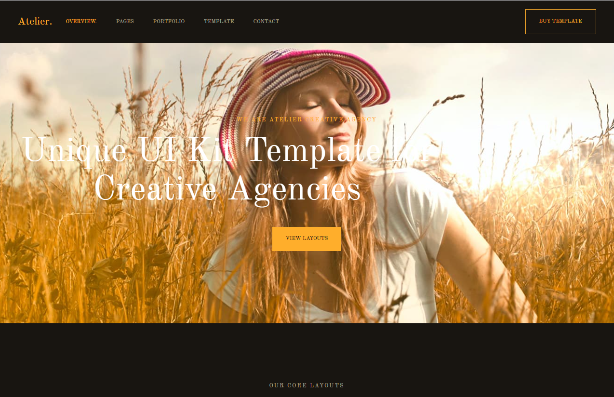

# Atelier Website 🎨

Учебный проект: сайт-портфолио, выполненный по макету (desktop версия).

---

## 📸 Превью



---

## 🔗 Live Demo

[Смотреть сайт на GitHub Pages](https://bashmachok1982.github.io/Atelier-project/)

---

## ✨ Особенности

- Верстка по макету (desktop)
- Использован flexbox для построения сеток
- Работа с SVG-спрайтами для иконок
- Наведение (hover) и фокус состояния для ссылок и кнопок
- Семантическая структура HTML

---

## 🛠 Технологии

- HTML5
- CSS3 (Flexbox)
- GitHub Pages (деплой)

---

## 🚀 Запуск локально

1. Склонировать репозиторий:
   ```bash
   git clone git@github.com:Bashmachok1982/Atelier-project.git
   ```
   👨‍💻 Автор

Alexandr — GitHub
